# 四国军棋坐标系统设计

## 概述

本文档定义了四国军棋棋盘的坐标系统，用于棋子位置定位、移动计算和游戏逻辑实现。

## 坐标系选择

### 方案一：棋盘中心为原点（推荐）

考虑到四国军棋的对称性和游戏特点，建议采用**棋盘正中心交汇处**作为坐标原点(0,0)。

**优势：**
- 符合四国军棋的对称设计理念
- 便于计算四个玩家区域的相对位置
- 中心区域是游戏的核心交汇点，具有重要的战略意义
- 坐标计算更加直观和对称

**坐标系定义：**
- **原点位置**：棋盘正中心交汇处 `boardData[8][8]`（数组索引从0开始，这是第9行第9列）
- **中央区域**：5×5区域 `boardData[6-10][6-10]`，其中索引7和9的行列在显示时被隐藏
- **X轴方向**：水平方向，向右为正
- **Y轴方向**：垂直方向，向下为正
- **坐标范围**：X轴 [-8, 8]，Y轴 [-8, 8]

**重要说明：**
- 数组索引从0开始计数
- `boardData[8][8]` 是17×17数组的正中心位置
- 这也是中央5×5区域（索引6-10）的几何中心
- 虽然索引7和9的行列被隐藏显示，但在坐标计算中仍然存在

### 坐标转换公式

```typescript
// 数组索引转换为游戏坐标（以boardData[8][8]为原点）
function arrayToGameCoord(row: number, col: number): [number, number] {
  const gameX = col - 8;  // 列索引转X坐标，8是原点列索引
  const gameY = row - 8;  // 行索引转Y坐标，8是原点行索引
  return [gameX, gameY];
}

// 游戏坐标转换为数组索引
function gameCoordToArray(x: number, y: number): [number, number] {
  const row = y + 8;  // Y坐标转行索引，加上原点偏移
  const col = x + 8;  // X坐标转列索引，加上原点偏移
  return [row, col];
}

// 验证示例
// boardData[8][8] -> 游戏坐标(0, 0) ✓ 原点
// boardData[0][0] -> 游戏坐标(-8, -8) ✓ 左上角
// boardData[16][16] -> 游戏坐标(8, 8) ✓ 右下角
```

## 棋盘区域划分

### 四个玩家区域坐标范围

```
绿方区域（上方）：
- 数组索引：[0-5][6-10]
- 游戏坐标：X[-2, 2], Y[-8, -3]

蓝方区域（左侧）：
- 数组索引：[6-10][0-5]
- 游戏坐标：X[-8, -3], Y[-2, 2]

红方区域（右侧）：
- 数组索引：[6-10][11-16]
- 游戏坐标：X[3, 8], Y[-2, 2]

黄方区域（下方）：
- 数组索引：[11-16][6-10]
- 游戏坐标：X[-2, 2], Y[3, 8]

中央公共区域：
- 数组索引：[6-10][6-10]（跳过空行列）
- 游戏坐标：X[-2, 2], Y[-2, 2]
```

### 关键位置坐标

#### 大本营位置
```typescript
const headquartersPositions = [
  // 绿方大本营
  { array: [0, 7], game: [-1, -8] },
  { array: [0, 9], game: [1, -8] },
  
  // 黄方大本营
  { array: [16, 7], game: [-1, 8] },
  { array: [16, 9], game: [1, 8] },
  
  // 红方大本营
  { array: [7, 16], game: [8, -1] },
  { array: [9, 16], game: [8, 1] },
  
  // 蓝方大本营
  { array: [7, 0], game: [-8, -1] },
  { array: [9, 0], game: [-8, 1] }
];
```

#### 行营位置坐标
```typescript
const campPositions = [
  // 绿方行营
  { array: [4, 7], game: [-1, -4] },
  { array: [4, 9], game: [1, -4] },
  { array: [3, 8], game: [0, -5] },
  { array: [2, 7], game: [-1, -6] },
  { array: [2, 9], game: [1, -6] },
  
  // 黄方行营
  { array: [12, 7], game: [-1, 4] },
  { array: [12, 9], game: [1, 4] },
  { array: [13, 8], game: [0, 5] },
  { array: [14, 7], game: [-1, 6] },
  { array: [14, 9], game: [1, 6] },
  
  // 红方行营
  { array: [7, 12], game: [4, -1] },
  { array: [9, 12], game: [4, 1] },
  { array: [8, 13], game: [5, 0] },
  { array: [7, 14], game: [6, -1] },
  { array: [9, 14], game: [6, 1] },
  
  // 蓝方行营
  { array: [7, 4], game: [-4, -1] },
  { array: [9, 4], game: [-4, 1] },
  { array: [8, 3], game: [-5, 0] },
  { array: [7, 2], game: [-6, -1] },
  { array: [9, 2], game: [-6, 1] }
];
```

#### 中央区域关键位置
```typescript
const centralPositions = [
  // 中央3×3实际显示的位置
  { array: [6, 6], game: [-2, -2] },   // 左上
  { array: [6, 8], game: [0, -2] },    // 上中
  { array: [6, 10], game: [2, -2] },   // 右上
  { array: [8, 6], game: [-2, 0] },    // 左中
  { array: [8, 8], game: [0, 0] },     // 中心（原点）
  { array: [8, 10], game: [2, 0] },    // 右中
  { array: [10, 6], game: [-2, 2] },   // 左下
  { array: [10, 8], game: [0, 2] },    // 下中
  { array: [10, 10], game: [2, 2] }    // 右下
];
```

## 坐标系应用示例

### 距离计算
```typescript
// 计算两点间的曼哈顿距离
function manhattanDistance(pos1: [number, number], pos2: [number, number]): number {
  return Math.abs(pos1[0] - pos2[0]) + Math.abs(pos1[1] - pos2[1]);
}

// 计算两点间的欧几里得距离
function euclideanDistance(pos1: [number, number], pos2: [number, number]): number {
  const dx = pos1[0] - pos2[0];
  const dy = pos1[1] - pos2[1];
  return Math.sqrt(dx * dx + dy * dy);
}
```

### 方向判断
```typescript
// 获取从起点到终点的方向向量
function getDirection(from: [number, number], to: [number, number]): [number, number] {
  const dx = to[0] - from[0];
  const dy = to[1] - from[1];
  
  // 标准化方向（-1, 0, 1）
  const dirX = dx === 0 ? 0 : dx / Math.abs(dx);
  const dirY = dy === 0 ? 0 : dy / Math.abs(dy);
  
  return [dirX, dirY];
}

// 判断是否为有效的移动方向（8方向）
function isValidDirection(direction: [number, number]): boolean {
  const [dx, dy] = direction;
  return Math.abs(dx) <= 1 && Math.abs(dy) <= 1 && (dx !== 0 || dy !== 0);
}
```

### 区域判断
```typescript
// 判断坐标属于哪个玩家区域
function getPlayerArea(x: number, y: number): string {
  if (y >= -8 && y <= -3 && x >= -2 && x <= 2) return 'green';
  if (y >= 3 && y <= 8 && x >= -2 && x <= 2) return 'yellow';
  if (x >= -8 && x <= -3 && y >= -2 && y <= 2) return 'red';
  if (x >= 3 && x <= 8 && y >= -2 && y <= 2) return 'blue';
  if (x >= -2 && x <= 2 && y >= -2 && y <= 2) return 'center';
  return 'invalid';
}

// 判断是否为行营位置
function isCampPosition(x: number, y: number): boolean {
  const [row, col] = gameCoordToArray(x, y);
  return boardData[row]?.[col]?.type === 'camp';
}
```

## 移动规则应用

### 基本移动
```typescript
// 检查基本移动是否有效（一步移动）
function isValidBasicMove(from: [number, number], to: [number, number]): boolean {
  const direction = getDirection(from, to);
  const distance = manhattanDistance(from, to);
  
  // 基本移动：相邻格子，8个方向
  return isValidDirection(direction) && distance === 1;
}
```

### 铁路线移动
```typescript
// 检查铁路线移动是否有效
function isValidRailwayMove(from: [number, number], to: [number, number]): boolean {
  // 铁路线移动规则：直线移动，路径上不能有棋子阻挡
  const direction = getDirection(from, to);
  
  // 必须是直线方向（水平、垂直或对角线）
  if (!isValidDirection(direction)) return false;
  
  // 检查路径上是否有阻挡
  let current = [from[0] + direction[0], from[1] + direction[1]];
  while (current[0] !== to[0] || current[1] !== to[1]) {
    if (hasPieceAt(current)) return false;
    current = [current[0] + direction[0], current[1] + direction[1]];
  }
  
  return true;
}
```

## 实现建议

1. **坐标转换函数**：在游戏逻辑中统一使用游戏坐标，在渲染时转换为数组索引
2. **位置验证**：所有移动操作前都要验证坐标的有效性
3. **区域检查**：根据坐标快速判断棋子所在区域，应用相应规则
4. **路径计算**：使用坐标系统计算最短路径和有效移动范围

## 总结

采用棋盘中心为原点的坐标系统，能够：
- 简化四个玩家区域的坐标计算
- 便于实现对称的游戏逻辑
- 提供直观的位置表示方法
- 支持高效的移动规则验证

这个坐标系统为后续的棋子移动、AI算法和网络同步提供了坚实的基础。

## 坐标系统可视化图表

### 精细网格坐标图

以下是四国军棋棋盘的详细坐标系统图表：

```
四国军棋精细坐标网格图 (以boardData[8][8]为原点(0,0))

行列标识: 行0  行1  行2  行3  行4  行5  行6  行7  行8  行9  行10 行11 行12 行13 行14 行15 行16
         列│-8 │-7 │-6 │-5 │-4 │-3 │-2 │-1 │ 0 │+1 │+2 │+3 │+4 │+5 │+6 │+7 │+8 │
────────┼───┼───┼───┼───┼───┼───┼───┼───┼───┼───┼───┼───┼───┼───┼───┼───┼───┤
行0  -8  │   │   │   │   │   │   │ ▲ │ G │ ▲ │ G │   │   │   │   │   │   │   │
────────┼───┼───┼───┼───┼───┼───┼───┼───┼───┼───┼───┼───┼───┼───┼───┼───┼───┤
行1  -7  │   │   │   │   │   │   │ G │ G │ G │ G │ G │   │   │   │   │   │   │
────────┼───┼───┼───┼───┼───┼───┼───┼───┼───┼───┼───┼───┼───┼───┼───┼───┼───┤
行2  -6  │   │   │   │   │   │   │ G │ ◉ │ G │ ◉ │ G │   │   │   │   │   │   │
────────┼───┼───┼───┼───┼───┼───┼───┼───┼───┼───┼───┼───┼───┼───┼───┼───┼───┤
行3  -5  │   │   │   │   │   │   │ G │ G │ ◉ │ G │ G │   │   │   │   │   │   │
────────┼───┼───┼───┼───┼───┼───┼───┼───┼───┼───┼───┼───┼───┼───┼───┼───┼───┤
行4  -4  │   │   │   │   │   │   │ G │ ◉ │ G │ ◉ │ G │   │   │   │   │   │   │
────────┼───┼───┼───┼───┼───┼───┼───┼───┼───┼───┼───┼───┼───┼───┼───┼───┼───┤
行5  -3  │   │   │   │   │   │   │ G │ G │ G │ G │ G │   │   │   │   │   │   │
────────┼───┼───┼───┼───┼───┼───┼───┼───┼───┼───┼───┼───┼───┼───┼───┼───┼───┤
行6  -2  │ R │ R │ R │ R │ R │ R │ ● │   │ ● │   │ ● │ B │ B │ B │ B │ B │ B │
────────┼───┼───┼───┼───┼───┼───┼───┼───┼───┼───┼───┼───┼───┼───┼───┼───┼───┤
行7  -1  │ R │ R │ R │ R │ R │ ◉ │   │   │   │   │   │ ◉ │ B │ B │ B │ B │ B │
────────┼───┼───┼───┼───┼───┼───┼───┼───┼───┼───┼───┼───┼───┼───┼───┼───┼───┤
行7  -1  │ ▲ │ R │ R │ R │ R │ R │   │   │   │   │   │ R │ R │ R │ R │ R │ ▲ │
────────┼───┼───┼───┼───┼───┼───┼───┼───┼───┼───┼───┼───┼───┼───┼───┼───┼───┤
行8   0  │ R │ R │ R │ R │ R │ R │ ● │   │[0]│   │ ● │ R │ B │ B │ B │ B │ B │
────────┼───┼───┼───┼───┼───┼───┼───┼───┼───┼───┼───┼───┼───┼───┼───┼───┼───┤
行9  +1  │ ▲ │ R │ R │ R │ R │ R │   │   │   │   │   │ R │ R │ R │ R │ R │ ▲ │
────────┼───┼───┼───┼───┼───┼───┼───┼───┼───┼───┼───┼───┼───┼───┼───┼───┼───┤
行9  +1  │ R │ R │ R │ R │ R │ ◉ │   │   │   │   │   │ ◉ │ B │ B │ B │ B │ B │
────────┼───┼───┼───┼───┼───┼───┼───┼───┼───┼───┼───┼───┼───┼───┼───┼───┼───┤
行10 +2  │ R │ R │ R │ R │ R │ R │ ● │   │ ● │   │ ● │ B │ B │ B │ B │ B │ B │
────────┼───┼───┼───┼───┼───┼───┼───┼───┼───┼───┼───┼───┼───┼───┼───┼───┼───┤
行11 +3  │   │   │   │   │   │   │ Y │ Y │ Y │ Y │ Y │   │   │   │   │   │   │
────────┼───┼───┼───┼───┼───┼───┼───┼───┼───┼───┼───┼───┼───┼───┼───┼───┼───┤
行12 +4  │   │   │   │   │   │   │ Y │ ◉ │ Y │ ◉ │ Y │   │   │   │   │   │   │
────────┼───┼───┼───┼───┼───┼───┼───┼───┼───┼───┼───┼───┼───┼───┼───┼───┼───┤
行13 +5  │   │   │   │   │   │   │ Y │ Y │ ◉ │ Y │ Y │   │   │   │   │   │   │
────────┼───┼───┼───┼───┼───┼───┼───┼───┼───┼───┼───┼───┼───┼───┼───┼───┼───┤
行14 +6  │   │   │   │   │   │   │ Y │ ◉ │ Y │ ◉ │ Y │   │   │   │   │   │   │
────────┼───┼───┼───┼───┼───┼───┼───┼───┼───┼───┼───┼───┼───┼───┼───┼───┼───┤
行15 +7  │   │   │   │   │   │   │ Y │ Y │ Y │ Y │ Y │   │   │   │   │   │   │
────────┼───┼───┼───┼───┼───┼───┼───┼───┼───┼───┼───┼───┼───┼───┼───┼───┼───┤
行16 +8  │   │   │   │   │   │   │ ▲ │ Y │ ▲ │ Y │   │   │   │   │   │   │   │
────────┴───┴───┴───┴───┴───┴───┴───┴───┴───┴───┴───┴───┴───┴───┴───┴───┴───┘
         列0  列1  列2  列3  列4  列5  列6  列7  列8  列9  列10 列11 列12 列13 列14 列15 列16

精细图例说明：
[0]  : 坐标原点 (0,0) - boardData[8][8] - 行8列8
G/R/B/Y : 绿/红/蓝/黄方玩家区域普通格子
●    : 中央公共区域显示格子
◉    : 行营位置
▲    : 大本营 (存放军旗的位置，每方2个)
空格  : 隐藏格子或空白区域

数组索引与坐标对照:
- 行索引 = 游戏坐标Y + 8
- 列索引 = 游戏坐标X + 8
- 例如: 坐标(0,0) = 数组[8][8] = 行8列8

大本营位置 (存放军旗):
绿方: ▲(-1,-8)[行0列7] ▲(+1,-8)[行0列9]
蓝方: ▲(-8,-1)[行7列0] ▲(-8,+1)[行9列0]
红方: ▲(+8,-1)[行7列16] ▲(+8,+1)[行9列16]
黄方: ▲(-1,+8)[行16列7] ▲(+1,+8)[行16列9]

行营位置详情:
绿方行营: ◉(-1,-6)[行2列7] ◉(0,-5)[行3列8] ◉(+1,-6)[行2列9] ◉(-1,-4)[行4列7] ◉(+1,-4)[行4列9]
蓝方行营: ◉(-6,-1)[行7列2] ◉(-5,0)[行8列3] ◉(-6,+1)[行9列2] ◉(-4,-1)[行7列4] ◉(-4,+1)[行9列4]
红方行营: ◉(+4,-1)[行7列12] ◉(+5,0)[行8列13] ◉(+4,+1)[行9列12] ◉(+6,-1)[行7列14] ◉(+6,+1)[行9列14]
黄方行营: ◉(-1,+4)[行12列7] ◉(0,+5)[行13列8] ◉(+1,+4)[行12列9] ◉(-1,+6)[行14列7] ◉(+1,+6)[行14列9]
```

### Mermaid 坐标关系图

```mermaid
graph TB
    subgraph "坐标系统结构"
        Origin["原点(0,0)<br/>boardData[8][8]"]
        
        subgraph "绿方区域 Y[-8,-3]"
            G1["(-2,-8)"] 
            G2["(0,-5)<br/>区域中心"]
            G3["(2,-8)"]
            GC1["(-1,-6)◉"] 
            GC2["(0,-5)◉"] 
            GC3["(1,-6)◉"]
            GC4["(-1,-4)◉"] 
            GC5["(1,-4)◉"]
        end
        
        subgraph "红方区域 X[-8,-3]"
            R1["(-8,-2)"]
            R2["(-5,0)<br/>区域中心"] 
            R3["(-8,2)"]
            RC1["(-6,-1)◉"] 
            RC2["(-5,0)◉"] 
            RC3["(-6,1)◉"]
            RC4["(-4,-1)◉"] 
            RC5["(-4,1)◉"]
        end
        
        subgraph "蓝方区域 X[3,8]"
            B1["(8,-2)"]
            B2["(5,0)<br/>区域中心"]
            B3["(8,2)"] 
            BC1["(4,-1)◉"] 
            BC2["(5,0)◉"] 
            BC3["(4,1)◉"]
            BC4["(6,-1)◉"] 
            BC5["(6,1)◉"]
        end
        
        subgraph "黄方区域 Y[3,8]"
            Y1["(-2,8)"]
            Y2["(0,5)<br/>区域中心"]
            Y3["(2,8)"]
            YC1["(-1,4)◉"] 
            YC2["(0,5)◉"] 
            YC3["(1,4)◉"]
            YC4["(-1,6)◉"] 
            YC5["(1,6)◉"]
        end
        
        subgraph "中央区域"
            C1["(-2,-2)●"]
            C2["(0,-2)●"] 
            C3["(2,-2)●"]
            C4["(-2,0)●"]
            Origin
            C5["(2,0)●"]
            C6["(-2,2)●"]
            C7["(0,2)●"]
            C8["(2,2)●"]
        end
    end
    
    Origin --> G2
    Origin --> R2  
    Origin --> B2
    Origin --> Y2
    
    style Origin fill:#ff6b6b,stroke:#333,stroke-width:3px
    style G2 fill:#51cf66,stroke:#333,stroke-width:2px
    style R2 fill:#ff8787,stroke:#333,stroke-width:2px
    style B2 fill:#74c0fc,stroke:#333,stroke-width:2px
    style Y2 fill:#ffd43b,stroke:#333,stroke-width:2px
```



### 关键坐标点标注

```
重要位置坐标对照表：

┌─────────────────┬──────────────┬─────────────────┐
│   位置描述      │   数组索引   │   游戏坐标      │
├─────────────────┼──────────────┼─────────────────┤
│ 棋盘左上角      │ [0][0]       │ (-8, -8)        │
│ 棋盘右上角      │ [0][16]      │ (8, -8)         │
│ 棋盘左下角      │ [16][0]      │ (-8, 8)         │
│ 棋盘右下角      │ [16][16]     │ (8, 8)          │
│ 坐标原点        │ [8][8]       │ (0, 0)          │
├─────────────────┼──────────────┼─────────────────┤
│ 绿方区域中心    │ [3][8]       │ (0, -5)         │
│ 红方区域中心    │ [8][3]       │ (-5, 0)         │
│ 蓝方区域中心    │ [8][13]      │ (5, 0)          │
│ 黄方区域中心    │ [13][8]      │ (0, 5)          │
├─────────────────┼──────────────┼─────────────────┤
│ 中央区域左上    │ [6][6]       │ (-2, -2)        │
│ 中央区域右上    │ [6][10]      │ (2, -2)         │
│ 中央区域左下    │ [10][6]      │ (-2, 2)         │
│ 中央区域右下    │ [10][10]     │ (2, 2)          │
└─────────────────┴──────────────┴─────────────────┘
```

### 军营位置坐标图

```
军营分布坐标图：

绿方军营 (上方):
     -1   0   1
  -6  ●       ●     (-1,-6) (1,-6)
  -5      ●         (0,-5)
  -4  ●       ●     (-1,-4) (1,-4)

红方军营 (左侧):        蓝方军营 (右侧):
-6  ●                        ●  6
-5    ●                    ●    5  
-4  ●                        ●  4
    -6 -5 -4                4  5  6

黄方军营 (下方):
   4  ●       ●     (-1,4) (1,4)
   5      ●         (0,5)
   6  ●       ●     (-1,6) (1,6)
     -1   0   1
```

### 坐标系统使用示例

```typescript
// 示例：计算从绿方军营到中央的距离
const greenCamp = [-1, -4];  // 绿方军营位置
const center = [0, 0];       // 中央原点
const distance = Math.abs(greenCamp[0] - center[0]) + Math.abs(greenCamp[1] - center[1]);
// 结果：distance = 5 (曼哈顿距离)

// 示例：判断位置是否在红方区域
function isInRedArea(x: number, y: number): boolean {
  return x >= -8 && x <= -3 && y >= -2 && y <= 2;
}

// 示例：获取相邻8个方向的坐标
function getAdjacentPositions(x: number, y: number): [number, number][] {
  const directions = [
    [-1, -1], [-1, 0], [-1, 1],  // 上方三个
    [0, -1],           [0, 1],   // 左右两个
    [1, -1],  [1, 0],  [1, 1]    // 下方三个
  ];
  return directions.map(([dx, dy]) => [x + dx, y + dy]);
}
```

这个可视化图表清晰地展示了：
1. **坐标原点的位置**：棋盘正中心 (0,0)
2. **四个玩家区域的分布**：相对于原点的对称布局
3. **重要位置的具体坐标**：便于编程时快速定位
4. **军营的精确坐标**：为移动规则提供参考

通过这个坐标系统，开发者可以轻松实现棋子移动、路径计算和游戏规则验证。


